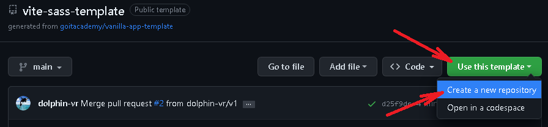
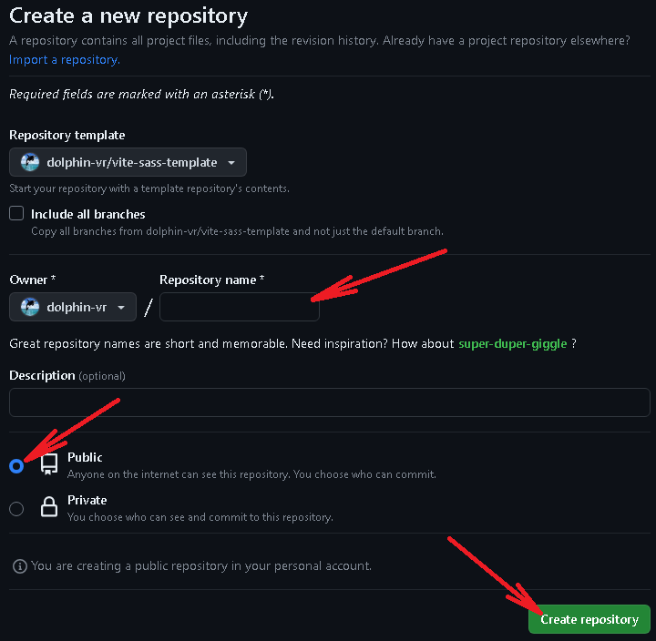
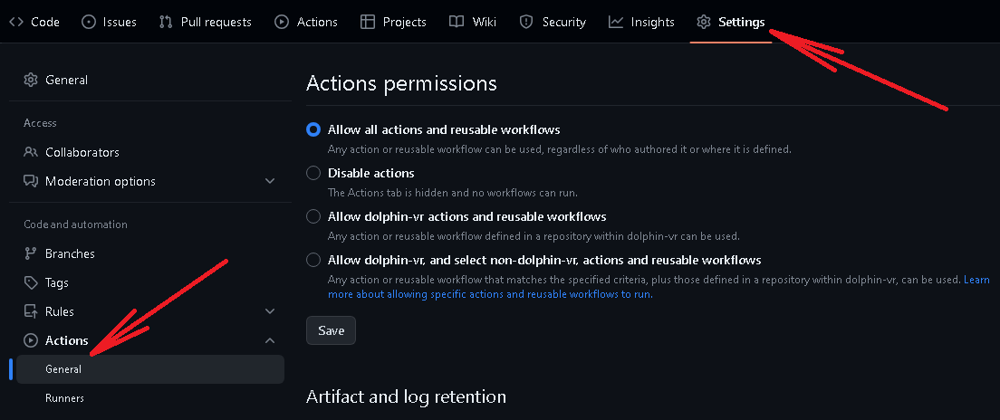
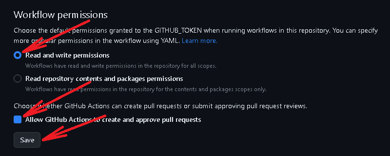
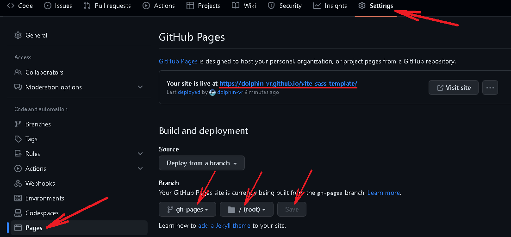

# Vite with SASS Template

This project is based on the project [Vanilla App Template](https://github.com/goitacademy/vanilla-app-template).

New major feature is support SASS instead of standart CSS.


## Creating a repository from a template

Click `«Use this template»` then `«Create a new repository»`.



Enter the name of the repository and press `«Create repository from template»`.



In the tab `Settings` > `Actions` > `General` scroll down to section 
`«Workflow permissions»` and choose `«Read and write permissions»`.






## Preparation for work

1. Install LTS-version Node.js.
   [Download and install](https://nodejs.org/en/).
2. Install the basic dependencies of the project. Run the command in the terminal 
  `npm install`.
3. Start development mode, `npm run dev`.
4. Go to the address in the browser [http://localhost:5173](http://localhost:5173).


## Deploy

The production version of the project will be automatically built and deployed to GitHub Pages,
 in the `gh-pages` branch, whenever the `main` branch is updated.
 For this it is necessary in the file `package.json` change the value of the `--base=/<REPO>/` flag,
 for the `build` command, replacing `<REPO>` with the name of your repository, and push your
 changes to GitHub.

```json
"build": "vite build --base=/<REPO>/",
```
Next, you need to go to the settings of the GitHub repository (`Settings` > `Pages`) and
set distribution of the production version of files from the `/root` folder of the `gh-pages` branch,
if it was not done automatically.




### Live page

The live page can be viewed by the address indicated on the `Settings` > `Pages` tab in the
repository settings.
For example, here is a link to the live version for this repository

[https://dolphin-vr.github.io/vite-sass-template/](https://dolphin-vr.github.io/vite-sass-template/).
